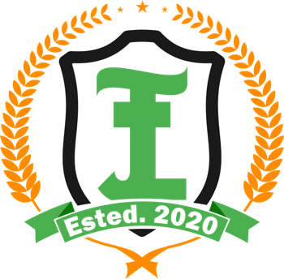

# R Tutorials: Master Data Science with R and the Tidyverse

<<<<<<< HEAD
R Tutorials is a repository dedicated to sharing data science resources and tutorials using R, specifically focusing on the {tidyverse} ecosystem. This repo is perfect for those looking to learn R programming for the first time or enhance their existing R skills. Join us to explore the power of {tidyverse} and elevate your data science journey with R!

=======

>>>>>>> 91e5373 (updated files)

Welcome to the R Tutorials GitHub repository!
This is your go-to resource for learning and mastering data science using the R programming language, with a primary focus on the Tidyverse collection of packages.
This repository is designed for beginners taking their first steps into R programming and experienced users who want to enhance their R programming skills.

## **Repository Overview**

This repository is divided into several sections, each designed to help you learn and practice essential R programming concepts:

1.  **Introduction to R Programming:** Get started with the basics of R programming, such as data structures, control structures, functions, and package management.

2.  **Data Wrangling with Tidyverse:** Learn how to transform, clean, and manipulate data using Tidyverse packages like **`dplyr`**, **`tidyr`**, and **`purrr`**.

3.  **Data Visualization with ggplot2:** Master the art of data visualization using the popular **`ggplot2`** package, including creating bar charts, histograms, scatterplots, and more.

4.  **Statistical Analysis with R:** Perform various statistical analyses using R, such as hypothesis testing, linear regression, logistic regression, and more.

5.  **Advanced R Programming:** Dive into advanced topics like metaprogramming, Rcpp, and Shiny to create interactive web applications.

6.  **R Markdown and Reproducible Research:** Learn how to create dynamic and reproducible reports using R Markdown and integrate your analyses with other document formats.

7.  **R in the Real World:** Explore real-life examples and case studies to see how R can be applied to solve real-world data science problems.

## **Getting Started**

To get started with the R Tutorials, follow these steps:

1.  Install the latest version of R from the [**official website**](https://cran.r-project.org/).

2.  Install [**RStudio**](https://rstudio.com/products/rstudio/download/), the recommended integrated development environment (IDE) for R.

3.  Familiarize yourself with RStudio by following this [**RStudio tutorial**](https://rstudio.com/resources/webinars/getting-started-with-rstudio/).

4.  Clone or download this repository to your local machine.

5.  Open the relevant R script files (.R) or Quarto files (.Rmd) in RStudio and start learning!

## **Contributing**

We encourage contributions from the R community!
If you'd like to contribute to this repository, please follow these steps:

1.  Fork the repository.

2.  Create a new branch with a descriptive name.

3.  Make your changes and commit them to your branch.

4.  Submit a pull request, describing the changes you made and the motivation behind them.

We appreciate any contributions, whether it's fixing typos, improving explanations, or adding new content.

## **License**

This project is licensed under the MIT License - see the [**LICENSE**](https://chat.openai.com/LICENSE) file for details.

## **Connect with the Author**

If you have any questions, suggestions, or feedback, please feel free to reach out to me:

-   [**LinkedIn**](https://www.linkedin.com/in/tongakuot/)

-   [YouTube - Jonglei Institute of Technology](https://youtube.com/@tongakuot)

-   [**Email**](mailto:info@jongleiinstitute.com)

Happy learning, and enjoy your journey toward becoming an R and data science expert!
\>\>\>\>\>\>\> 49741b6 (updated tutorials repo)
